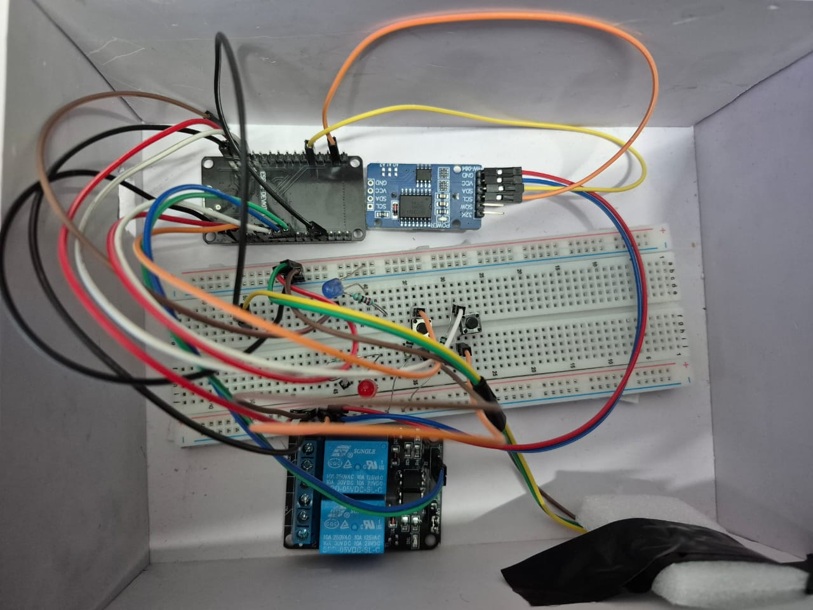

# Smart Electrical Safety Cut-Off System

## Description
A smart electrical safety system using ESP32 that automatically disconnects power during unsafe conditions like overheating.

## Working
The system monitors temperature and electrical conditions. When unsafe conditions are detected, it cuts off power using a relay module.

## Components
- ESP32
- Temperature Sensor
- Relay Module

## Features
- Automatic power cut-off
- Prevents overheating
- Enhances electrical safety
## Project Image

